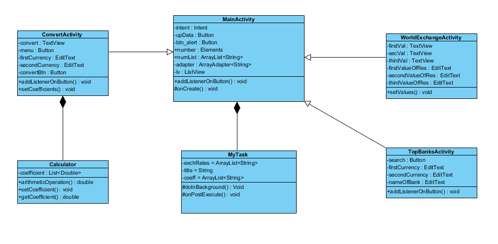
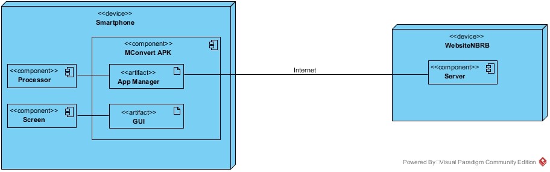

# UML Диаграммы
1. [Диаграмма активности](#1)
2. [Диаграмма последовательности](#2)
3. [Диаграмма состояний](#3)
4. [Диаграмма классов](#4)
5. [Диаграмма компонентов](#5)
6. [Диаграмма развертывания](#6)

### 2. Диаграммы активности
Диаграммы активности: ([Ru](https://github.com/v4rgon/MConvert/blob/master/Documents/Diagrams/Activity/README.md)).

### 3. Диаграммы последовательности
Все диаграммы: ([Ru](https://github.com/v4rgon/MConvert/blob/master/Documents/Diagrams/Sequence/README.md)).

### 4. Диаграмма состояний
Все диаграммы: ([Ru](https://github.com/v4rgon/MConvert/blob/master/Documents/Diagrams/State/README.md)).

### 5. Диаграмма классов
Диаграмма классов представляет собой следующую диаграмму:

### 6. Диаграмма компонентов

### 7. Диаграмма развертывания

